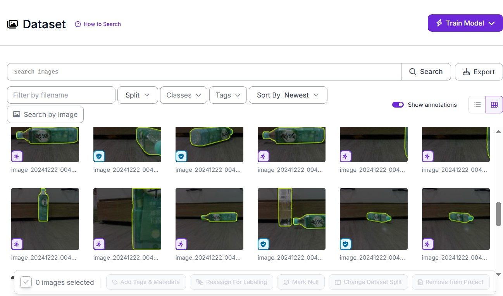
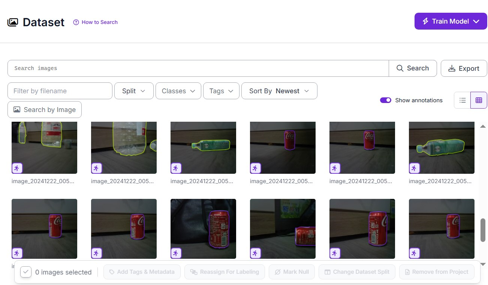
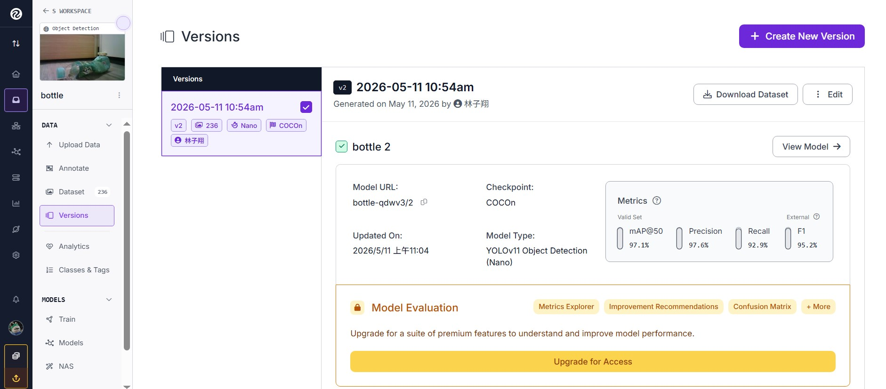
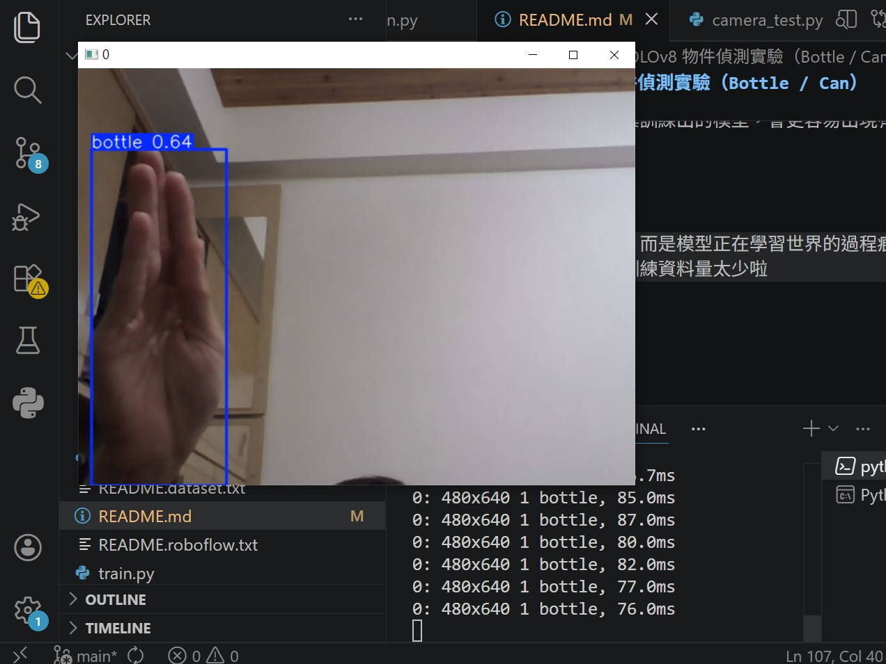

# 🧠 YOLOv8 物件偵測實驗（Bottle / Can）

這是一個基於 YOLOv8 的小型電腦視覺實驗專案，用於學習物件偵測的基本流程。

本專案並不是大型商業應用，而是我在學習 AI / Computer Vision 過程中的一個「人工製作的訓練紀錄」。

---

## 🧪 專案目的

這個專案的目的是：

- 理解 YOLOv8 訓練流程
- 嘗試自訂資料集訓練模型
- 建立從「資料 → 標註 → 訓練 → 推論」的完整流程

---

## 📦 資料集說明

本專案資料集為**人工蒐集與標註**，規模較小：

- 📸 約 200+ 張圖片
- 🏷️ 類別：
  - bottle（瓶子）
  - can（鋁罐）

所有標註皆為手動或半手動完成（Roboflow / Label 工具）。

👉 資料量較小，因此模型仍屬於「學習與實驗階段」，非最佳化版本。

---

## 🧠 模型資訊

- 模型架構：YOLOv8n（Ultralytics）
- 框架：PyTorch
- 訓練方式：自訂資料集訓練
- 輸入尺寸：640x640
- 訓練輪數：10 epochs（測試用途）

---

## 📂 專案結構
YOLO/
├── train.py # 訓練模型
├── camera_test.py # 即時辨識
├── best.pt # 訓練後模型
├── dataset/
│ ├── data.yaml
│ ├── train/
│ ├── valid/
│ └── test/
└── README.md

## 📷 實際鏡頭測試（Webcam Inference）

本專案已進行實際攝影機即時測試，使用訓練完成的 YOLOv8 模型進行推論。

測試方式為：

使用電腦內建webcam
即時進行 object detection
標註畫面中的 bottle 與 can

## 🎥 測試結果

以下為實際辨識結果截圖（Inference Screenshots）：

### 🟢畫面1:沒見過的化妝品瓶子

### 🟢畫面2:訓練時出現的可樂罐

### 🟢畫面3:透明寶特瓶

## 🧠 測試觀察

在實際 webcam 測試中觀察到：

✔ bottle 在光線良好情況下辨識穩定
✔ can 類別效果良好
⚠ 有時候「我的手」會被誤判為 bottle...
⚠ 在物體重疊或光線較差時偶爾出現誤判
⚠ 小型資料集（200+ 張）仍有限制模型泛化能力

## 😂 模型有趣的誤判情境（實驗觀察）

在實際 webcam 測試過程中，模型偶爾會出現一些「有趣的誤判結果」，這也是小型資料集訓練中常見的現象。

👤 出現人臉或人體時，可能會被標記成 can 或 bottle
🧃 背景物件（例如桌面反光、塑膠袋皺褶）會被誤判為目標物
📦 空白區域偶爾會出現錯誤 bounding box

## 💭 實驗心得

這些「奇怪的誤判」其實比正確結果更有學習價值。

它讓我更清楚理解：

AI 並不是在「理解物體」，而是在學習「統計上的視覺相似性」。

也因此，小型資料集訓練出的模型，會更容易出現有趣但不完美的結果。

## 😄 小結論

這些錯誤不是失敗，而是模型正在學習世界的過程痕跡，也同時應證了訓練資料量太少啦